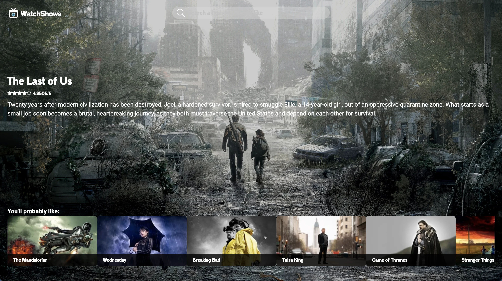

# Movie DB

Tmdb is a page about television and streaming series, in which the user can search from the newest, most viewed, to his favorite. It shows the description of each one with a rating ranking that they have been given in the API. This page was made with data from themoviedb API.



## Get started

The first thing to do is open the terminal of your code editor of your choice and once there you will have to make sure to enter the folder called "tmdb-app-webpack-main", to enter it you must write "cd tmdb-app-webpack-main".

```sh
   cd ..
   cd tmdb-app-webpack-main
```

Once the following command is executed, you should run the next one:

```sh
   yarn run start
```

After completing these steps, now you will be able to use the page normally, for that you have to open your browser and write the following in the URL; http://localhost:3000/

## UI

Built with React js, react-dom, react-scripts, react-bootstrap-icons, css, bootstrap

## API

https://developer.themoviedb.org/docs
